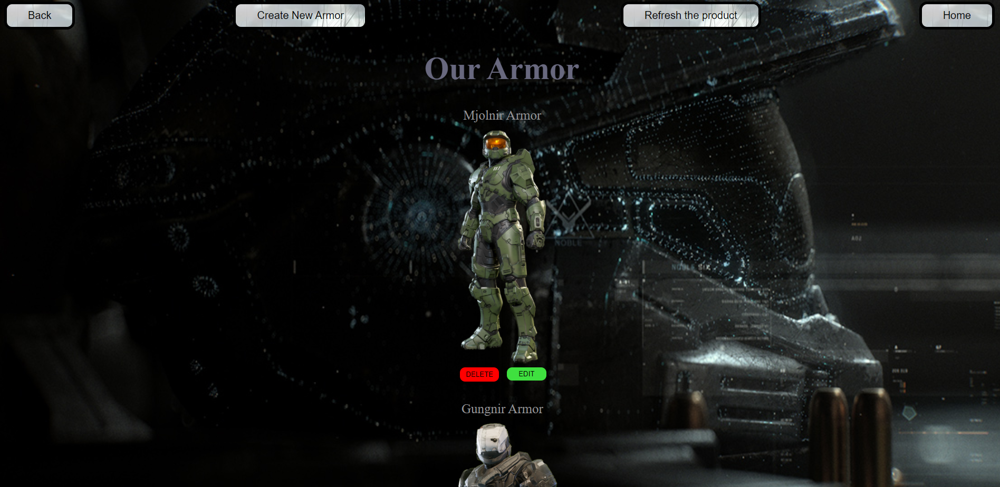

<h1>Halo Workshop</h1>
<h4>Web application that can supply you with any form of Halo Equipment<h4>

<h2>Languages and Stragtegies used</h2>
<ul>
<li>HTML</li>
<li>CSS</li>
<li>JavaScript</li>
<li>CRUD/REST</li>
<li>ExpressJS</li>
<li>EJS</li>
<li>Schema/Model Technology</li>
<li>Heroku</li>
</ul>

<h2>Getting Started</h2>

[Click Here](https://haloshopapp.herokuapp.com/)  to see the application in action! 

<h2>Future Enhancements</h2>

<ul>
<li> I want an add to cart option in the future</li>
<li> I want only logged in users to be able to buy and add to cart (auth) </li>
<li> I want to fix the colors on some of the pages, making it easier to read</li>
</ul>
  
<h2>Take a look!</h2>

